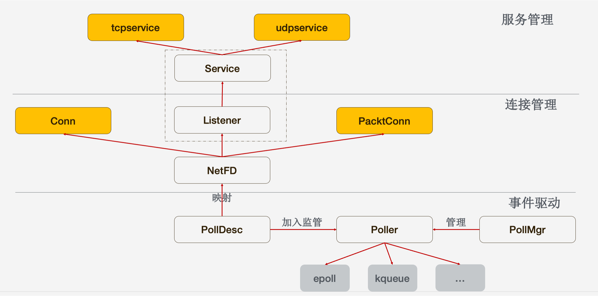

## 整体结构

整个设计的核心点在于通过直接使用 epoll/kqueue 来对连接进行管理，使得连接数和协程数解耦。对于通常的 go/net 来说是 __一个连接一个协程__，不论这个连接活跃与否；而 tnet 的设计保证了只有在连接活跃时才会占据一个协程，由此极大减少了内存的占用并减轻了 GC 的压力。

整个结构的设计层次如下：

### 服务启动

用户通过 `tnet.NewTCPService` 来创建一个 TCP 服务，然后调用 `Serve` 来启用监听，从而能够使用 tnet 提供的功能，这是可以看到的部分。而看不到的部分则是引入的 `package internal/poller` 中的 `init` 里会自动调用 `NewPollMgr(RoundRobin, 1)` （见 `internal/poller/pollmgr.go`）来创建一个负载均衡策略为 `RoundRobin` 的一个 poller 协程。一个 poller 协程也许是不够的，我们可以通过 `tnet.SetNumPollers` 来设置我们所需要的总的 poller 协程数。

TODO(wineguo)
